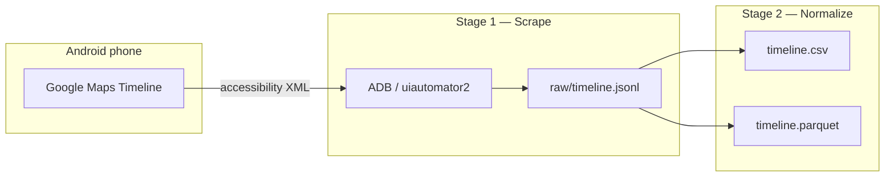

<div align="center">

# maps-timeline

### Recover your Google Maps Timeline — straight from your Android phone

[](https://www.python.org/)
[](https://docs.astral.sh/uv/)
[](#prerequisites)
[](#prerequisites)
[](LICENSE)

---

[](https://github.com/adanmauri/maps-timeline/actions/workflows/tests.yaml)
[](https://github.com/adanmauri/maps-timeline/actions/workflows/quality.yml)
[](https://github.com/adanmauri/maps-timeline/actions/workflows/security.yaml)
[](https://github.com/adanmauri/maps-timeline/actions/workflows/tests.yaml)

---

Extract your Google Maps location history (**Timeline**) **directly from the app UI**
on a physical Android device via **ADB** and the Android accessibility tree.

No Google API. No Takeout. Your data stays on devices you control.

</div>

<br />

## Table of Contents

- [About](#about)
- [Features](#features)
- [How it works](#how-it-works)
- [Tech stack](#tech-stack)
- [Quick start](#quick-start)
- [Commands](#commands)
- [Output layout](#output-layout)
- [Explore & visualize](#explore--visualize)
- [Troubleshooting](#troubleshooting)
- [Privacy](#privacy)
- [Contributing](#contributing)
- [Documentation](#documentation)
- [License](#license)

<br />

## About

Google **removed the ability to download your own location history**. The Timeline used to
be exportable from your account (Google Takeout / Maps Timeline export). That changed:
Google **migrated the Timeline to on-device storage**. Your history now lives **only on
your phone** — viewable day by day inside the Maps app, with **no official bulk export**.

`maps-timeline` works around that by **reading what the app renders on screen**: it drives
the phone over ADB, walks the Timeline backwards one day at a time, and reconstructs a
structured dataset you can analyze in CSV, Parquet, or pandas.

> **Disclaimer:** unofficial tool. It does not call any Google API — it only reads the
> accessibility hierarchy of Google Maps already installed on **your** phone.

<p align="right">(<a href="#table-of-contents">back to top</a>)</p>

## Features

| | |
| --- | --- |
| **Two-stage pipeline** | Raw scrape (JSONL) decoupled from normalization — reprocess without re-scanning the phone |
| **Versioned exports** | Each run lands in `data/runs/<timestamp>/` with a `data/latest` pointer |
| **Offline parser tests** | `parse-file` works on saved XML dumps — no device required |
| **Optional geocoding** | Resolve addresses to lat/lon via Nominatim (OpenStreetMap), cached locally |
| **Resilient scraping** | Skips or aborts on navigation errors; saves debug XML + PNG on failures |
| **100% test coverage** | Pure parsing layer tested against synthetic and real UI dumps |

<p align="right">(<a href="#table-of-contents">back to top</a>)</p>

## How it works



1. Your phone shows the Timeline one day at a time inside Google Maps.
2. The tool connects over USB and **reads the accessibility tree** (XML of UI nodes).
3. It records every place and trip, taps **Previous day**, and repeats.
4. A second stage parses durations, distances, and times into **CSV + Parquet**.

Deep dive: [`docs/ARCHITECTURE.md`](docs/ARCHITECTURE.md).

<p align="right">(<a href="#table-of-contents">back to top</a>)</p>

## Tech stack

| Layer | Tools |
| --- | --- |
| **Runtime** | Python 3.13+, [uv](https://docs.astral.sh/uv/) |
| **CLI** | [Typer](https://typer.tiangolo.com/) |
| **Data** | [pandas](https://pandas.pydata.org/), [PyArrow](https://arrow.apache.org/docs/python/) |
| **Models** | [Pydantic](https://docs.pydantic.dev/) |
| **Device** | ADB, [uiautomator2](https://github.com/openatx/uiautomator2) |
| **Geocoding** | [Nominatim](https://nominatim.org/) (optional) |
| **Quality** | pytest (100% coverage), ruff, mypy, pyright, pylint, bandit |

<p align="right">(<a href="#table-of-contents">back to top</a>)</p>

## Quick start

### Prerequisites

**Computer** (macOS, Windows, or Linux)

| Requirement | macOS | Windows | Linux |
| --- | --- | --- | --- |
| **Python 3.13+** | Installed by `uv tool` if needed | [python.org](https://www.python.org/downloads/) or `winget install Python.Python.3.13` | Installed by `uv tool` if needed, or your distro / [python.org](https://www.python.org/downloads/) |
| **[uv](https://docs.astral.sh/uv/)** | `curl -LsSf https://astral.sh/uv/install.sh \| sh` | `powershell -ExecutionPolicy ByPass -c "irm https://astral.sh/uv/install.ps1 \| iex"` | Same install script as macOS |
| **ADB** | `brew install android-platform-tools` | [Platform-tools](https://developer.android.com/tools/releases/platform-tools) zip → add folder to `PATH` | e.g. `sudo apt install adb` (Debian/Ubuntu) or your distro's `android-tools` package |

After installing ADB, confirm it is on your `PATH`: `adb version`.

**Phone** (Android)

1. Enable **USB debugging** (*Settings → About phone → tap Build number 7× → Developer options → USB debugging*).
2. Connect via USB and **accept the "Allow USB debugging?" prompt**.
3. Verify: `adb devices` should list your phone.

### Install as a tool

Recommended if you only want to run the CLI — no clone, no local virtualenv to manage.

**With [uv](https://docs.astral.sh/uv/)** (isolated global install):

```bash
uv tool install git+https://github.com/adanmauri/maps-timeline.git
maps-timeline --help
```

**With [pipx](https://pipx.pypa.io/)** (Python 3.13+ on your `PATH`):

```bash
pipx install git+https://github.com/adanmauri/maps-timeline.git
maps-timeline --help
```

**With pip** (into the active environment):

```bash
pip install git+https://github.com/adanmauri/maps-timeline.git
```

**From a GitHub release** ([Releases](https://github.com/adanmauri/maps-timeline/releases)):

```bash
pip install https://github.com/adanmauri/maps-timeline/releases/download/v0.1.0/maps_timeline-0.1.0-py3-none-any.whl
```

> Not published on PyPI yet. Requires **Python 3.13+** unless you use `uv tool install`.

> The first scrape may install a small uiautomator2 helper app on the phone. This is expected.

### Development install

Clone the repo if you plan to change the code or run the test suite:

```bash
git clone https://github.com/adanmauri/maps-timeline.git
cd maps-timeline
uv sync                              # creates .venv and installs the package in editable mode
uv run maps-timeline --help
```

See [`docs/DEVELOPMENT.md`](docs/DEVELOPMENT.md) for `make quality`, tests, and pre-commit hooks.

### Prepare Google Maps

On the phone, open **Google Maps → Timeline → Day** on the day you want to start
stepping back from.

**Recommended** (Developer options):

- Disable **Window / Transition / Animator scale** (set to *Off*).
- Keep the screen **on** during long scrapes.

The scraper expands the bottom activity sheet if collapsed, but starting with the full day
list visible is more reliable.

### Export

```bash
# All-in-one: scrape N days, normalize, print summary
maps-timeline run --days 7

# Or step by step:
maps-timeline scrape --days 7
maps-timeline normalize
maps-timeline stats
```

When using the **development install**, prefix commands with `uv run` (e.g.
`uv run maps-timeline run --days 7`).

Each default scrape creates a **versioned run folder** under `data/runs/`. The file
`data/latest` points at the most recent run so `normalize` and `stats` work without extra
flags.

<p align="right">(<a href="#table-of-contents">back to top</a>)</p>

## Commands

Examples below use the `maps-timeline` command (tool install). With the development
install, prefix with `uv run`.

| Command | Phone? | What it does |
| --- | :---: | --- |
| `run` | Yes | Scrape → normalize → print summary |
| `scrape` | Yes | Walk the Timeline backwards, write raw JSONL |
| `normalize` | No | JSONL → CSV + Parquet |
| `stats` | No | Console summary of the clean dataset |
| `parse-file` | No | Offline parser test on a saved XML dump |
| `dump` | Yes | Save one screen dump (debug selectors) |

Full option reference: [`docs/CLI.md`](docs/CLI.md).

### Recipes

```bash
# Scrape a month, geocode addresses, show top 20 places
maps-timeline run --days 30 --geocode --nominatim-email you@example.com --top 20

# Re-normalize the latest run after a parser upgrade (no phone)
maps-timeline normalize

# Re-normalize a specific run
maps-timeline normalize --jsonl data/runs/2026-06-16_143022/raw/timeline.jsonl

# Force the raw ADB driver (no uiautomator2)
maps-timeline scrape --days 3 --prefer adb

# Stop on navigation errors (default: skip and continue)
maps-timeline scrape --days 10 --on-error abort

# Offline: verify parser against a saved dump
maps-timeline parse-file dump_dia.xml
```

### Optional geocoding

The Timeline UI exposes **text** (place + address), not coordinates. Pass `--geocode` to
resolve addresses via **Nominatim (OpenStreetMap)**.

- Best-effort: approximate results, especially without street numbers.
- Cached in `data/cache/geocode.json`.
- Rate-limited (~1 req/s). Pass `--nominatim-email`.

Details: [`docs/DATA.md`](docs/DATA.md#geocoding).

<p align="right">(<a href="#table-of-contents">back to top</a>)</p>

## Output layout

Sensitive exports live under `data/`, which is **gitignored**.

```
data/
├── latest                          # text file → path of the most recent run
├── cache/
│   └── geocode.json                # Nominatim cache (--geocode)
└── runs/
    └── 2026-06-16_143022/          # one export run (timestamp)
        ├── raw/
        │   ├── timeline.jsonl      # one JSON object per day (raw text)
        │   └── debug/              # XML + PNG on parse/navigation failures
        └── clean/
            ├── timeline.csv
            └── timeline.parquet
```

### Clean dataset columns

| Column | Description |
| --- | --- |
| `day` | `YYYY-MM-DD` |
| `type` | `place_visit`, `activity`, `unconfirmed_visit`, `unknown_visit`, `missing_transit` |
| `title` | Place name or transport mode (e.g. driving) |
| `address` | Street address when shown |
| `start_iso` / `end_iso` | Parsed clock times as ISO 8601 |
| `duration_min` / `distance_km` | Numeric trip stats |
| `confirmed` | `false` for unconfirmed visits |
| `needs_user_action` | `true` when Google could not fully resolve the segment |
| `lat` / `lon` | Present when exported with `--geocode` |

Schema details: [`docs/DATA.md`](docs/DATA.md).

<p align="right">(<a href="#table-of-contents">back to top</a>)</p>

## Explore & visualize

```bash
maps-timeline stats          # totals, busiest day, top places
maps-timeline stats --top 20
```

```python
import pandas as pd

df = pd.read_parquet("data/runs/2026-06-16_143022/clean/timeline.parquet")

df.groupby("day")["distance_km"].sum()                    # km per day
df[df["type"] == "place_visit"]["title"].value_counts()   # most visited places
df.groupby("day")["duration_min"].sum().plot.bar()       # travel time per day
```

Open `timeline.csv` in any spreadsheet, or explore in the terminal with
[VisiData](https://www.visidata.org/) (`vd timeline.csv`). With `--geocode`, plot places
from the `lat`/`lon` columns.

<p align="right">(<a href="#table-of-contents">back to top</a>)</p>

## Troubleshooting

| Symptom | Likely cause | What to do |
| --- | --- | --- |
| `adb devices` shows nothing | Cable, driver, or debugging off | Re-plug USB, accept the prompt, try another cable |
| `No export runs found` | Never scraped, or `data/` deleted | Run `scrape` or `run` first |
| `Timeline 'Day' view is not visible` | Wrong Maps screen | Open **Timeline → Day** on the start day |
| `activity list is collapsed` | Bottom sheet shows map only | Swipe the sheet up; scraper also tries to expand it |
| `Expected date X but app shows Y` | Header drift / wrong start day | Re-open Maps on the intended day and retry |
| `Could not find 'Previous day' button` | UI change or wrong language | Save a `dump`, check `content-desc` for the prev-day button |
| `0 segments but summary shows N visits` | Parser mismatch | Check `raw/debug/` XML; file an issue with an anonymized dump |
| uiautomator2 connection fails | Helper app not installed | Retry; or use `--prefer adb` |
| Geocoding is slow | Many unique addresses | Normal — cached after first run; ~1 addr/sec |

Debug artifacts: `<run>/raw/debug/{date}_{tag}.xml` and `.png`.

```bash
maps-timeline dump --out dump.xml     # capture current screen
maps-timeline parse-file dump.xml     # test parser offline
```

<p align="right">(<a href="#table-of-contents">back to top</a>)</p>

## Privacy

Your location history is **sensitive personal data**. Everything under `data/` contains
real places and timestamps — **never commit or share it**. This tool only reads from a
device you control; it does not upload your Timeline anywhere (except optional Nominatim
lookups when you pass `--geocode`).

<p align="right">(<a href="#table-of-contents">back to top</a>)</p>

## Contributing

Contributions are welcome. The highest-impact changes are usually **anonymized XML dumps**
that expose parser edge cases and **offline tests** that lock the behavior in.

```bash
uv sync                    # or make install-dev for pre-commit hooks
make quality && make test  # lint, types, security, then tests (100% coverage)
uv run maps-timeline parse-file dump_dia.xml
```

1. Respect layer boundaries — see [`docs/ARCHITECTURE.md`](docs/ARCHITECTURE.md).
2. Open a PR or file a device bug with environment details (Maps version, resolution, OEM skin).
3. Never attach real location data — anonymize dumps first.

Full guide: [`docs/DEVELOPMENT.md`](docs/DEVELOPMENT.md) · Agent skills: [`.agents/skills/`](.agents/skills/).

<p align="right">(<a href="#table-of-contents">back to top</a>)</p>

## Documentation

| Document | Audience | Contents |
| --- | --- | --- |
| **This README** | Everyone | Motivation, quick start, workflows, troubleshooting |
| [`docs/ARCHITECTURE.md`](docs/ARCHITECTURE.md) | Contributors | Layers, scraping loop, UI findings, reliability |
| [`docs/CLI.md`](docs/CLI.md) | Users | Full command and option reference |
| [`docs/DATA.md`](docs/DATA.md) | Analysts | JSONL / CSV / Parquet schemas |
| [`docs/DEVELOPMENT.md`](docs/DEVELOPMENT.md) | Contributors | Dev setup, `make` targets, testing, PR workflow |
| [`AGENTS.md`](AGENTS.md) | AI agents | Coding standards and guardrails |

<p align="right">(<a href="#table-of-contents">back to top</a>)</p>

## License

Distributed under the [MIT License](LICENSE).

<p align="right">(<a href="#table-of-contents">back to top</a>)</p>
